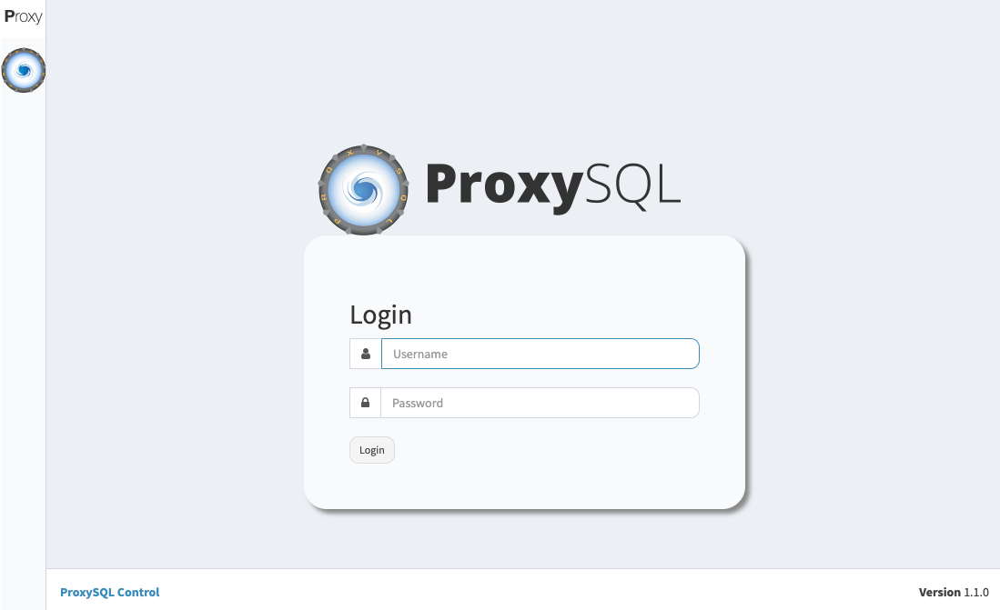

# ProxySQL Control in Docker

ProxySQL Control Dashboard is forked to [FlaskDashboard](https://github.com/SanderWegter/FlaskDashboard) Dashboard



## Installation

- clone the repository

> git clone https://github.com/alexyucra/Control_ProxySQL

- build and run

```shell
docker-compose up -d --build
```

- install database and configure access 
  
```shell
# create database
docker exec -it mariadb mysql -u root -pPassword123! -e "CREATE DATABASE proxyctl;"

# import database mysql -u root -p FlaskDashboard < database.sql
docker exec -i mariadb mysql -uroot -pPassword123! proxyctl < ./app/database.sql
```
