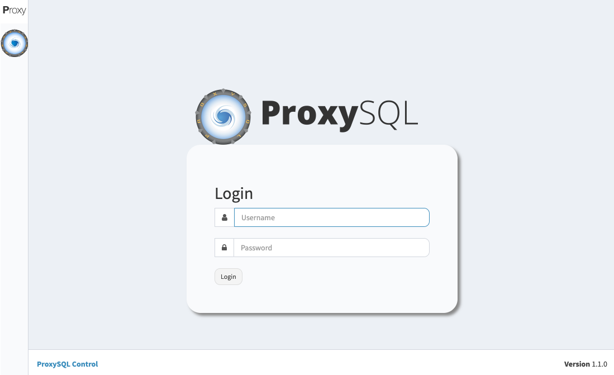
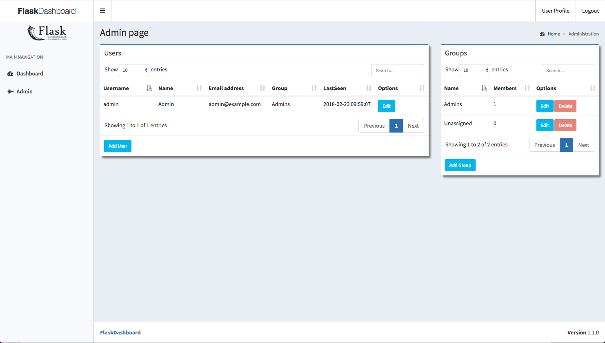

# FlaskDashboard
A Dashboard using the [AdminLTE](https://adminlte.io/themes/AdminLTE/index2.html) theme with authentication. 

## Functionalities
 - User Creation & Authentication
 - Group creating
 - Role based access - Admins and 'other' usergroups
 - Basis for a customizable dashboard

## Installation
```
sudo apt update
sudo apt upgrade
sudo apt install python3 python3-dev python3-pip mysql-server libmysqlclient-dev

#Optional 
sudo apt install nginx
```

```
sudo pip3 install -r requirements.txt
```

```
mysql -u root -p
mysql>CREATE DATABASE FlaskDashboard;
mysql>exit
```

The default username/password is 'admin:password1234'
If you want to change the default user's name or password, edit the database.sql file. The password can be generated like this:
```
python3
>>> import bcrypt
>>> pass = "YourNewPassword"
>>> bcrypt.hashpw(pass.encode('utf-8'), bcrypt.gensalt(10))
```
This will print a string which looks like this:
`$2b$10$3DMGei4SVxcjfrNsV62.5ug8Q4FusVhQpQkWl9SqPoGfiqrQU5DRa`
Paste this into the database.sql file

```
mysql -u root -p FlaskDashboard < database.sql
```

Rename and edit the config file
```
mv config.yaml.default config.yaml
vi config.yaml
```

Edit `nav.py` for more menu's

### This project is WIP.

Nginx config for SSL setup
```
server {
	listen 80;
	server_name example.com;

	listen 443 ssl;
	ssl_certificate /etc/letsencrypt/live/example.com/fullchain.pem;
	ssl_certificate_key /etc/letsencrypt/live/example.com/privkey.pem;
	include /etc/letsencrypt/options-ssl-nginx.conf;
	ssl_dhparam /etc/letsencrypt/ssl-dhparams.pem;


	if ($scheme != "https") {
		return 301 https://$host$request_uri;
	}

	location / {
		proxy_pass https://127.0.0.1:22222;
	proxy_redirect off;
	proxy_set_header Host $host;
	proxy_set_header X-Real-IP $remote_addr;
	proxy_set_header X-Forwarded-For $proxy_add_x_forwarded_for;
	proxy_set_header X-Forwarded-Proto $scheme;
	}
}
```

